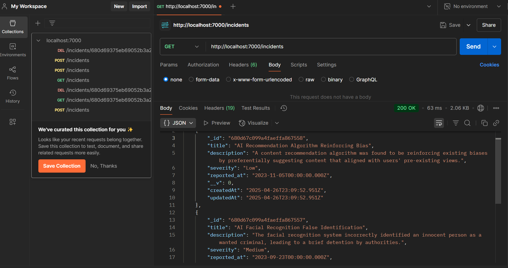
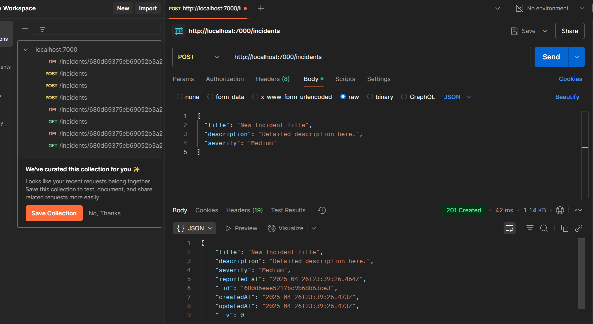
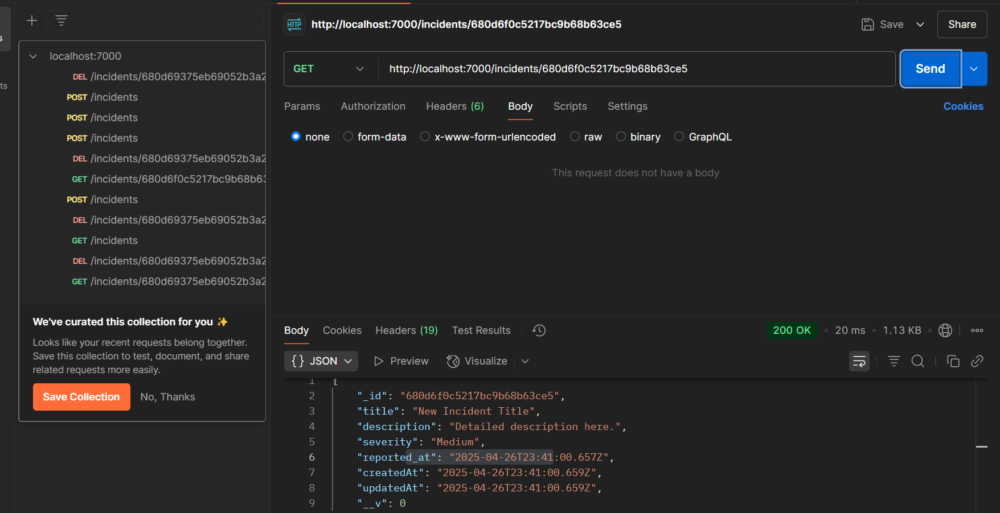
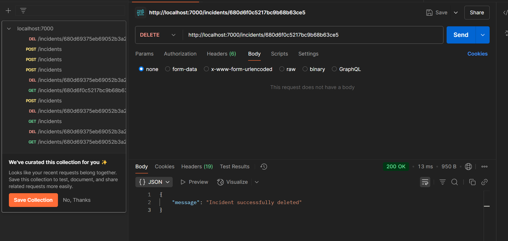
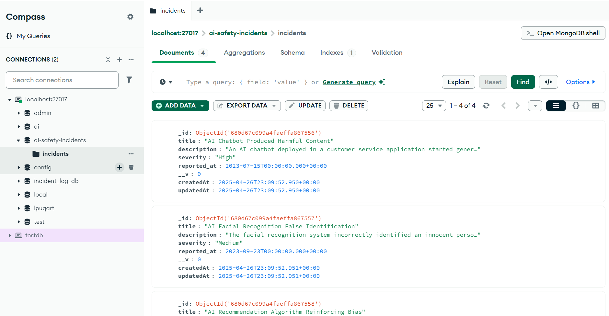

# AI Safety Incident Log API

A RESTful API service for logging and managing AI safety incidents. This project serves as a backend solution for tracking hypothetical AI safety incidents with comprehensive data tracking and management capabilities.

## 📋 Project Overview

This project implements a backend API service for HumanChain's AI Safety Incident Log. It provides endpoints to create, retrieve, and delete AI safety incidents, allowing for efficient management of hypothetical AI safety events.


## screen shots of implementation








## 🎯 Project Objectives

1. **Data Management**: Efficiently store and retrieve AI safety incident data using MongoDB.
2. **RESTful API Design**: Implement clean, well-structured API endpoints following REST principles.
3. **Validation**: Ensure data integrity through robust validation of input data.
4. **Error Handling**: Gracefully handle errors and provide meaningful responses.
5. **Scalable Architecture**: Design a scalable architecture that can be extended with additional features.
6. **Security**: Implement basic security measures to protect the API.

## 🚀 Detailed Setup Guide

### Prerequisites

- **Node.js** (v14 or later)
  - Download and install from [nodejs.org](https://nodejs.org/)
  - Verify installation with `node --version`
- **MongoDB**
  - **Option 1**: Local Installation
    - Download and install from [mongodb.com](https://www.mongodb.com/try/download/community)
    - Start MongoDB service: `mongod --dbpath="C:\data\db"` (Windows) or `sudo systemctl start mongod` (Linux)
  - **Option 2**: MongoDB Atlas (Cloud)
    - Create a free account at [mongodb.com/cloud/atlas](https://www.mongodb.com/cloud/atlas)
    - Create a new cluster
    - Configure network access to allow connections from your IP
    - Create a database user
    - Get your connection string from the "Connect" button

### Step-by-Step Installation

1. **Clone the repository**:
   ```bash
   git clone <repository-url>
   cd ai-safety-incidents
   ```

2. **Install dependencies**:
   ```bash
   npm install
   ```
   This will install all required packages defined in package.json:
   - express: Web framework for Node.js
   - mongoose: MongoDB object modeling tool
   - dotenv: Environment variables manager
   - cors: Cross-Origin Resource Sharing middleware
   - helmet: Security middleware
   - morgan: HTTP request logger

3. **Environment Configuration**:
   
   Create a `.env` file in the root directory with the following variables:
   ```
   PORT=7000
   MONGODB_URI=mongodb://localhost:27017/ai-safety-incidents
   NODE_ENV=development
   ```

   **For MongoDB Atlas**, replace the MONGODB_URI with your Atlas connection string:
   ```
   MONGODB_URI=mongodb+srv://<username>:<password>@<cluster-url>/<dbname>?retryWrites=true&w=majority
   ```

4. **Database Seeding**:

   Populate the database with sample incidents:
   ```bash
   npm run seed
   ```
   
   This command executes `src/utils/seed.js` which:
   - Connects to your MongoDB database
   - Clears any existing incidents
   - Inserts 3 sample AI safety incidents:
     1. AI Chatbot Produced Harmful Content
     2. AI Facial Recognition False Identification
     3. AI Recommendation Algorithm Reinforcing Bias

5. **Start the Application**:

   Development mode (with auto-reload):
   ```bash
   npm run dev
   ```

   Production mode:
   ```bash
   npm start
   ```

   You should see console output like:
   ```
   Server running on port 7000 in development mode
   MongoDB Connected: localhost
   ```

## 📊 Data Model

### Incident Schema

| Field       | Type     | Description                    | Validation                    |
|-------------|----------|--------------------------------|-------------------------------|
| title       | String   | Brief summary of the incident  | Required                      |
| description | String   | Detailed incident information  | Required                      |
| severity    | String   | Assessed impact level          | Required, Enum: Low/Medium/High |
| reported_at | Date     | When the incident was reported | Default: Current timestamp    |

## 🏗️ Project Structure

```
ai-safety-incidents/
├── docs/                 # Project documentation
│   └── api-diagram.md    # API architecture diagrams
├── src/
│   ├── config/           # Configuration files
│   │   └── db.js         # Database connection setup
│   ├── controllers/      # Request handlers
│   │   └── incidentController.js
│   ├── models/           # Database models
│   │   └── incident.js   # Incident schema definition
│   ├── routes/           # API route definitions
│   │   └── incidentRoutes.js
│   ├── utils/            # Utility functions
│   │   └── seed.js       # Database seeding script
│   └── server.js         # Main application entry point
├── .env                  # Environment variables (create this yourself)
├── env.example           # Example environment variables
├── package.json          # Project dependencies and scripts
└── README.md             # Project documentation
```

## 🔄 Workflow Diagram

```
┌─────────────────┐     ┌─────────────────┐     ┌─────────────────┐
│                 │     │                 │     │                 │
│  HTTP Request   │────▶│  Express Router │────▶│   Controller    │
│                 │     │                 │     │                 │
└─────────────────┘     └─────────────────┘     └────────┬────────┘
                                                         │
                                                         ▼
┌─────────────────┐     ┌─────────────────┐     ┌─────────────────┐
│                 │     │                 │     │                 │
│   HTTP Response │◀────│ JSON Processing │◀────│  Mongoose Model │
│                 │     │                 │     │                 │
└─────────────────┘     └─────────────────┘     └─────────────────┘
```

## 📋 API Documentation

### Base URL
When running locally: `http://localhost:7000`

### Endpoints

#### 1. GET /incidents

- **Description**: Retrieve all incidents
- **Implementation**: 
  - Uses Mongoose's `find()` method to retrieve all incidents
  - Sorts the results by `reported_at` date in descending order
- **Request Format**: No request body needed
- **Response**: 
  - 200 OK with a JSON array of incident objects
  ```json
  [
    {
      "_id": "65a1b2c3d4e5f6a7b8c9d0e1",
      "title": "AI Chatbot Produced Harmful Content",
      "description": "An AI chatbot deployed in a customer service application started generating harmful and inappropriate responses after being exposed to biased training data.",
      "severity": "High",
      "reported_at": "2023-07-15T00:00:00.000Z",
      "createdAt": "2023-12-10T14:30:00.000Z",
      "updatedAt": "2023-12-10T14:30:00.000Z"
    },
    {
      "_id": "65a1b2c3d4e5f6a7b8c9d0e2",
      "title": "AI Facial Recognition False Identification",
      "description": "The facial recognition system incorrectly identified an innocent person as a wanted criminal, leading to a brief detention by authorities.",
      "severity": "Medium",
      "reported_at": "2023-09-23T00:00:00.000Z",
      "createdAt": "2023-12-10T14:30:00.000Z",
      "updatedAt": "2023-12-10T14:30:00.000Z"
    }
  ]
  ```
  - 500 Internal Server Error if database query fails

#### 2. POST /incidents

- **Description**: Log a new incident
- **Implementation**:
  - Validates required fields (title, description, severity)
  - Validates that severity is one of: 'Low', 'Medium', 'High'
  - Creates a new document in the incidents collection
- **Request Body**: JSON object containing title, description, and severity
  ```json
  {
    "title": "New Incident Title",
    "description": "Detailed description here.",
    "severity": "Medium"
  }
  ```
- **Response**: 
  - 201 Created with the JSON object of the newly created incident
  ```json
  {
    "_id": "65a1b2c3d4e5f6a7b8c9d0e3",
    "title": "New Incident Title",
    "description": "Detailed description here.",
    "severity": "Medium",
    "reported_at": "2023-12-10T14:30:00.000Z",
    "createdAt": "2023-12-10T14:30:00.000Z",
    "updatedAt": "2023-12-10T14:30:00.000Z"
  }
  ```
  - 400 Bad Request if validation fails (missing fields or invalid severity)
  - 500 Internal Server Error if database operation fails

#### 3. GET /incidents/{id}

- **Description**: Retrieve a specific incident by its ID
- **Implementation**:
  - Uses Mongoose's `findById()` method to retrieve a specific incident
  - Checks if the incident exists and returns appropriate response
- **Path Parameter**: `id` - The MongoDB ObjectId of the incident
- **Request Format**: No request body needed
- **Response**:
  - 200 OK with a JSON object representing the requested incident
  ```json
  {
    "_id": "65a1b2c3d4e5f6a7b8c9d0e1",
    "title": "AI Chatbot Produced Harmful Content",
    "description": "An AI chatbot deployed in a customer service application started generating harmful and inappropriate responses after being exposed to biased training data.",
    "severity": "High",
    "reported_at": "2023-07-15T00:00:00.000Z",
    "createdAt": "2023-12-10T14:30:00.000Z",
    "updatedAt": "2023-12-10T14:30:00.000Z"
  }
  ```
  - 404 Not Found if no incident with the given id exists
  - 500 Internal Server Error if database query fails

#### 4. DELETE /incidents/{id}

- **Description**: Delete an incident by its ID
- **Implementation**:
  - Uses Mongoose's `findById()` to check if the incident exists
  - Uses `deleteOne()` method to remove the incident
- **Path Parameter**: `id` - The MongoDB ObjectId of the incident to delete
- **Request Format**: No request body needed
- **Response**:
  - 200 OK with a confirmation message
  ```json
  {
    "message": "Incident successfully deleted"
  }
  ```
  - 404 Not Found if no incident with the given id exists
  - 500 Internal Server Error if database operation fails

## 🔒 Security Considerations

- **Input Validation**: All API inputs are validated to prevent invalid data and potential injection attacks
- **HTTP Security Headers**: Implemented via Helmet middleware to enhance API security
- **CORS Protection**: Implemented to control which domains can access the API
- **Error Handling**: Custom error messages that avoid exposing sensitive information
- **Environment Variables**: Sensitive configuration is stored in environment variables

## 🧪 Testing with Postman

### Setting Up Postman

1. **Download and Install Postman**:
   - Download from [postman.com](https://www.postman.com/downloads/)
   - Install and launch the application

2. **Create a New Collection**:
   - Click "Collections" in the sidebar
   - Click the "+" icon to create a new collection
   - Name it "AI Safety Incidents API"

3. **Environment Setup** (Optional):
   - Click on "Environments" in the sidebar
   - Create a new environment called "Local Development"
   - Add a variable:
     - Name: `baseUrl`
     - Initial Value: `http://localhost:7000`
     - Current Value: `http://localhost:7000`
   - Click "Save"

### Testing Endpoints

#### Test 1: Get All Incidents

1. Create a new request:
   - Click the "+" tab to create a new request
   - Set method to "GET"
   - URL: `{{baseUrl}}/incidents` (or `http://localhost:7000/incidents` if not using environments)
   - Click "Save" and name it "Get All Incidents"

2. Send the request:
   - Click "Send"
   - You should receive a 200 OK response with an array of incidents

#### Test 2: Create New Incident

1. Create a new request:
   - Set method to "POST"
   - URL: `{{baseUrl}}/incidents`
   - Go to "Body" tab
   - Select "raw" and "JSON"
   - Enter the following JSON:
     ```json
     {
       "title": "AI System Unexpectedly Went Offline",
       "description": "An AI system monitoring critical infrastructure unexpectedly went offline for 30 minutes, potentially missing important alerts.",
       "severity": "Medium"
     }
     ```
   - Click "Save" and name it "Create Incident"

2. Send the request:
   - Click "Send"
   - You should receive a 201 Created response with the created incident object
   - Note the `_id` field for use in the next tests

#### Test 3: Get Incident by ID

1. Create a new request:
   - Set method to "GET"
   - URL: `{{baseUrl}}/incidents/INCIDENT_ID` (replace INCIDENT_ID with an actual ID from the previous response)
   - Click "Save" and name it "Get Incident by ID"

2. Send the request:
   - Click "Send"
   - You should receive a 200 OK response with the specific incident

#### Test 4: Delete Incident

1. Create a new request:
   - Set method to "DELETE"
   - URL: `{{baseUrl}}/incidents/INCIDENT_ID` (replace INCIDENT_ID with an actual ID)
   - Click "Save" and name it "Delete Incident"

2. Send the request:
   - Click "Send"
   - You should receive a 200 OK response with a deletion confirmation message

#### Test 5: Validation Error

1. Create a new request:
   - Set method to "POST"
   - URL: `{{baseUrl}}/incidents`
   - Go to "Body" tab
   - Select "raw" and "JSON"
   - Enter incomplete JSON (to test validation):
     ```json
     {
       "title": "Test Incident",
       "severity": "Critical"
     }
     ```
   - Click "Save" and name it "Test Validation"

2. Send the request:
   - Click "Send"
   - You should receive a 400 Bad Request response with a message about the missing description field
   - You should also get a validation error about the invalid severity level


## 📝 License

This project is licensed under the ISC License.

## 🔧 Troubleshooting

### Common Issues:

1. **MongoDB Connection Issues**:
   - Ensure MongoDB is running (`mongod` process)
   - Check connection string in .env file
   - Verify network settings if using MongoDB Atlas

2. **Port Already in Use**:
   - Change the PORT value in .env file if port 7000 is already in use

3. **Missing Dependencies**:
   - Run `npm install` again to ensure all dependencies are installed

4. **Invalid Request Bodies**:
   - Ensure you're sending valid JSON with correct field names
   - Check severity field is one of: "Low", "Medium", "High" 